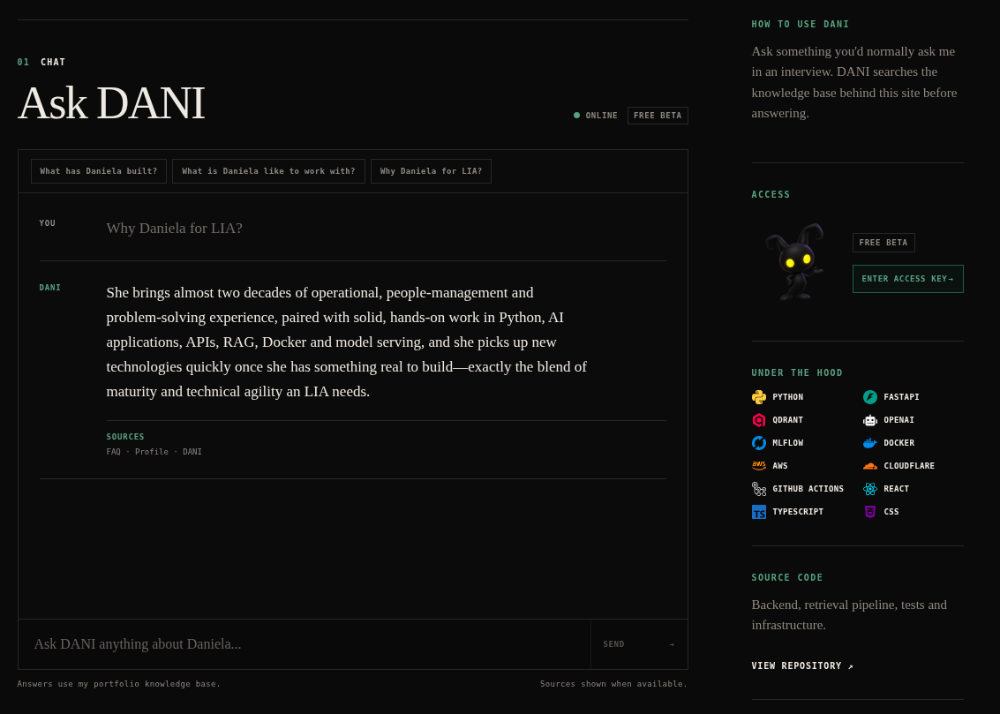

<p align="center">
  
  
  
  
  
  
  
</p>

<div align="center">
  
</div>

---

# DANI

**DANI** is an AI-powered interface to my portfolio.

Instead of making visitors dig through a CV, project descriptions and an About page, DANI lets them ask questions directly:

```text
What has Daniela built?
What technologies does she work with?
Tell me about her MLOps experience.
Which projects used Docker?
What is Daniela like to work with?
```

Answers are grounded in a curated knowledge base about my education, experience, projects and technical skills using **Retrieval-Augmented Generation (RAG)**.

The project started as a slightly over-engineered way of adding an AI assistant to my personal website.

It remained slightly over-engineered.

## Overview

DANI combines a FastAPI backend, Qdrant vector search, LLM generation and MLflow observability in a small production-deployed RAG application.

The system provides:

* **RAG-based portfolio search** from Markdown knowledge documents
* **Source-backed answers** with retrieval metadata
* **Conversation context** for follow-up questions
* **Free and premium access tiers**
* **OpenAI and OpenRouter model support**
* **MLflow tracing and metrics**
* **Structured request logging**
* **Health and readiness checks**
* **Dockerized deployment on AWS EC2**

The frontend is part of my personal React/TypeScript website, while DANI runs as a separate backend service.

<!-- Future image: design/dani-architecture.png -->

## How It Works

The knowledge base is stored as Markdown files containing information about my profile, education, experience, skills and projects.

During ingestion, DANI:

```text
Markdown documents
        ↓
     Chunking
        ↓
 OpenAI embeddings
        ↓
      Qdrant
        ↓
 Similarity search
        ↓
  Relevant context
        ↓
       LLM
        ↓
Answer + sources
```

The current embedding model is `text-embedding-3-small`.

Each retrieved source includes metadata such as its document, section, chunk index and similarity score.

## Access Tiers

DANI supports two access levels:

```text
free
premium
```

Public requests use the free tier.

Premium access can be supplied through the:

```text
X-DANI-Access-Key
```

header.

Keys are stored as SHA-256 hashes rather than plaintext values. Different tiers can use different model configurations, making it possible to keep the public version inexpensive while providing selected visitors with access to a more capable model.

## MLflow Observability

DANI uses MLflow to trace and inspect the RAG pipeline.

Tracked information includes:

* model and provider
* access tier
* retrieval settings
* number of sources
* retrieval score
* retrieval latency
* LLM latency
* total request latency
* answer length

MLflow is treated as a best-effort dependency: if the tracking server is unavailable, DANI can continue answering requests.

<!-- Future image: design/mlflow-screen.png -->

## Tech Stack

| Area               | Technology              |
| ------------------ | ----------------------- |
| Backend            | FastAPI                 |
| Language           | Python 3.14             |
| Vector database    | Qdrant                  |
| Embeddings         | OpenAI                  |
| LLM providers      | OpenAI / OpenRouter     |
| Observability      | MLflow                  |
| Logging            | structlog               |
| Validation         | Pydantic                |
| Package management | uv                      |
| Containerization   | Docker / Docker Compose |
| Deployment         | AWS EC2                 |
| CI/CD              | GitHub Actions          |
| Frontend           | React / TypeScript      |

## Project Structure

```text
.
├── backend/
│   ├── Dockerfile
│   ├── pyproject.toml
│   ├── src/
│   │   └── dani_api/
│   │       ├── api/
│   │       │   ├── access.py
│   │       │   ├── chat.py
│   │       │   ├── dependencies.py
│   │       │   └── models.py
│   │       ├── middleware/
│   │       │   └── request_logging.py
│   │       ├── rag/
│   │       │   ├── chunker.py
│   │       │   ├── embeddings.py
│   │       │   ├── ingest.py
│   │       │   ├── loader.py
│   │       │   ├── retrieval.py
│   │       │   ├── service.py
│   │       │   └── vector_store.py
│   │       ├── access.py
│   │       ├── config.py
│   │       ├── conversation.py
│   │       ├── llm.py
│   │       ├── logging_config.py
│   │       ├── main.py
│   │       ├── mlflow_tracking.py
│   │       └── prompts.py
│   └── tests/
│       ├── api/
│       └── unit/
├── frontend/
├── knowledge/
│   ├── projects/
│   │   ├── dani.md
│   │   ├── fullstack-taxi.md
│   │   ├── model-serving.md
│   │   └── wired-al.md
│   ├── education.md
│   ├── experience.md
│   ├── faq.md
│   ├── profile.md
│   └── skills.md
├── docker-compose.yml
└── README.md
```

## API

### Chat

```http
POST /api/chat
```

Example:

```bash
curl -X POST http://127.0.0.1:8000/api/chat \
  -H "Content-Type: application/json" \
  -d '{"message": "Which projects has Daniela worked on?"}'
```

A response contains the generated answer, its sources and the access tier used.

### Health

```http
GET /health
```

Returns:

```json
{
  "status": "ok"
}
```

### Readiness

```http
GET /ready
```

The readiness check verifies that required configuration is available, Qdrant can be reached and the knowledge collection contains data.

## Local Development

### 1. Install dependencies

```bash
cd backend
uv sync
```

### 2. Configure environment variables

Create a `.env` file in the project root.

```env
# Qdrant
QDRANT_URL=http://localhost:6333
QDRANT_COLLECTION=dani_knowledge

# OpenAI
OPENAI_API_KEY=your-openai-key-here
OPENAI_EMBEDDING_MODEL=text-embedding-3-small
OPENAI_CHAT_MODEL=gpt-5-mini

# OpenRouter
OPENROUTER_API_KEY=your-openrouter-key-here
OPENROUTER_CHAT_MODEL=your-openrouter-model-here
OPENROUTER_BASE_URL=https://openrouter.ai/api/v1

# Premium access
PREMIUM_ACCESS_KEY_HASHES={"key-1":"sha256-hash-here"}

# MLflow
MLFLOW_ENABLED=false
MLFLOW_TRACKING_URI=http://127.0.0.1:5000
MLFLOW_EXPERIMENT_NAME=dani
```

Do not commit real API keys or plaintext access keys.

### 3. Start Qdrant and MLflow

From the project root:

```bash
docker compose up -d qdrant mlflow
```

### 4. Ingest the knowledge base

From `backend/`:

```bash
uv run python -m dani_api.rag.ingest
```

### 5. Start the API

```bash
uv run uvicorn dani_api.main:app --reload
```

The API is available at:

```text
http://127.0.0.1:8000
```

FastAPI documentation:

```text
http://127.0.0.1:8000/docs
```

## Docker

The full backend stack can also be started with:

```bash
docker compose up --build
```

Docker Compose runs:

| Service   | Purpose             |
| --------- | ------------------- |
| `backend` | FastAPI application |
| `qdrant`  | Vector database     |
| `mlflow`  | Tracing and metrics |

Qdrant and MLflow use persistent Docker volumes.

## Deployment

DANI is deployed on **AWS EC2** using Docker Compose.

The production stack runs the FastAPI backend alongside Qdrant and MLflow, while **GitHub Actions** handles deployment when changes are pushed to the deployment branch.

The public interface lives on my portfolio website and communicates with the separately deployed DANI API.

<!-- Future image: design/deployment-screen.png -->

## Testing

The test suite covers the API and core RAG behaviour, including:

* chat requests and validation
* conversation context
* access tiers
* ingestion
* retrieval
* RAG service behaviour
* MLflow tracking
* CORS
* health checks and request IDs

Run it with:

```bash
cd backend
uv run pytest
```

## Why I Built It

A static CV is good at listing things.

It is less good at answering questions like:

```text
Has Daniela actually deployed anything?
What does she know about MLOps?
Which projects are relevant to this role?
What did she learn while building DANI?
```

DANI started as a way to make my portfolio more interactive, but became an opportunity to build a complete small-scale AI system around it: retrieval, model access, APIs, testing, observability, containers, CI/CD and cloud deployment.

In other words, I built a portfolio chatbot and accidentally gave myself infrastructure to maintain.

Which is, admittedly, quite on brand.

## Current Status

DANI is actively developed as part of my personal portfolio.

Current work focuses on improving retrieval quality, expanding the knowledge base, refining access-key management and continuing to improve production observability.

The goal is not for DANI to know everything about me.

The goal is for the things it **does** say to be grounded in actual information.